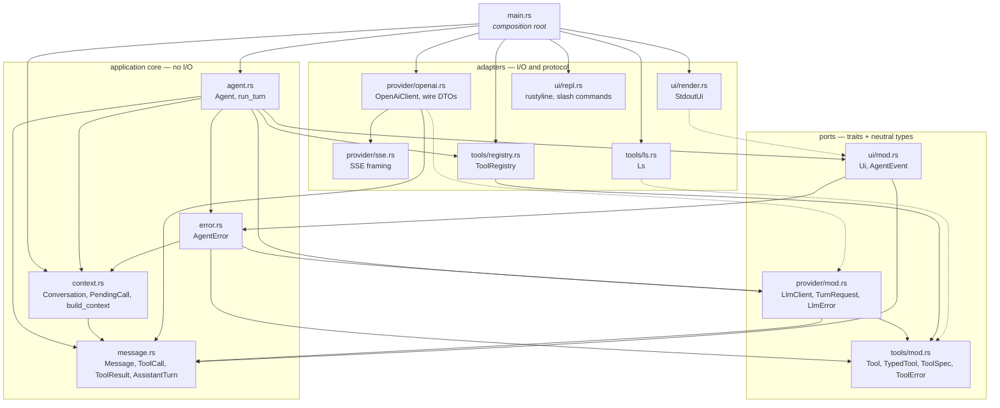

# crab architecture proposal

**Status:** proposal. Baseline `main` at `5ea4a65` does not compile and cannot complete a tool-call turn.

## Goal

The agent loop is the application core:

```text
prompt -> LLM -> zero or more tools -> LLM -> answer
```

The terminal, provider protocol, filesystem, and TUI are adapters. Dependencies point inward:

```text
main (composition root)
  -> Agent (application loop)
       -> LlmClient       (provider adapters)
       -> ToolRegistry    (concrete tool catalogue)
       -> Ui              (stdout/TUI adapters)
       -> Conversation    (concrete transcript + invariants)
```

Use traits only at proven seams:

| Seam | Adapters |
|---|---|
| `LlmClient` | OpenAI-compatible, Anthropic, fake |
| `Ui` | stdout, TUI, null |
| `Tool` | `ls`, read, write, edit, bash, grep |

`Conversation`, `ToolRegistry`, and context construction remain concrete until there is a real second implementation.

## Current problems

| Problem | Consequence |
|---|---|
| `ChatServer` owns `ToolRegistry` | Varying tools requires another HTTP client; sub-agents cannot reuse the loop cleanly. |
| OpenAI stream deltas cross the LLM port | Another provider must pretend to use OpenAI's wire protocol. |
| `Message` only holds role + string | Assistant tool calls and tool results cannot be represented. |
| `main.rs` parses provider deltas, streams, owns history, and handles tools | The loop is split across unrelated functions. |
| Only `calls[0]` is attempted | An assistant turn with N calls receives fewer than N tool results, which provider APIs reject. |
| `parse_chunk` emits at most one event | A chunk with text and several calls drops information. |

## Domain and transcript

Domain types have no serde derives. Each provider maps its DTOs to and from them.

```rust
pub struct ToolCall {
    pub id: String,
    pub name: String,
    pub arguments: String,
}

#[derive(Clone)]
pub struct ToolResult {
    pub content: String,
    pub is_error: bool,
}

pub enum AssistantTurn {
    Completed { text: String },
    ToolCalls { text: String, calls: Vec<ToolCall> },
    Truncated { text: String },
}

pub enum Message {
    System(String),
    User(String),
    Assistant { text: String, tool_calls: Vec<ToolCall> },
    Tool { call_id: String, result: ToolResult },
}
```

`AssistantTurn` encodes valid states: a completed turn cannot contain calls, and a truncated turn cannot accidentally be executed as a tool turn.

`Conversation` owns the N-calls/N-results invariant:

```rust
pub struct Conversation {
    messages: Vec<Message>,
    pending: Vec<String>,
}

pub struct PendingCall {
    id: String,
    name: String,
    arguments: String,
}

impl Conversation {
    pub fn new(system: Option<String>) -> Self;
    pub fn push_user(&mut self, text: impl Into<String>);
    #[must_use]
    pub fn push_assistant(&mut self, turn: AssistantTurn) -> Vec<PendingCall>;
    pub fn resolve(&mut self, call: PendingCall, result: ToolResult);
    pub fn messages(&self) -> Result<&[Message], Unresolved>;
    pub fn reset(&mut self);
}
```

`PendingCall` fields are private and exposed through accessors. Only `Conversation` can mint one; `resolve` validates and removes its ID, so it cannot be forged or resolved twice. `messages()` fails while calls are pending, making an invalid next request impossible.

## Ports and adapters

```rust
pub struct TurnRequest<'a> {
    pub messages: &'a [Message],
    pub tools: &'a [ToolSpec],
}

pub enum Delta {
    Text(String),
    ToolCallStarted { name: String },
}

#[async_trait]
pub trait LlmClient: Send + Sync {
    async fn send(
        &self,
        request: TurnRequest<'_>,
        on_delta: &mut (dyn FnMut(Delta) + Send),
    ) -> Result<AssistantTurn, LlmError>;
}

pub enum AgentEvent {
    TextDelta(String),
    ToolStarted { name: String },
    ToolFinished { name: String, result: ToolResult },
    TurnEnded,
    Error(AgentError),
}

pub trait Ui: Send + Sync {
    fn emit(&self, event: AgentEvent);
}
```

- The complete `AssistantTurn` is the LLM result; streaming is a callback. This makes fakes simple and keeps stream-driving errors out of the application interface.
- Providers own wire DTOs, request envelopes, SSE parsing, delta accumulation, and mapping. `ToolRegistry` produces provider-neutral `ToolSpec`; it does not produce OpenAI JSON.
- The SSE adapter must frame full SSE events, including multiline `data:` fields and split UTF-8, and emit every delta in an event.
- `Ui` receives owned events so a TUI can forward them through `tokio::sync::mpsc`. A new event does not expand the trait, but every adapter must explicitly choose a policy for it.
- `StdoutUi` writes and flushes; `NullUi` drops events. If rendering failures become fatal, the agent must record them without leaving pending calls unresolved.

## Agent

```rust
pub struct Agent {
    llm: Box<dyn LlmClient>,
    tools: ToolRegistry,
    ui: Box<dyn Ui>,
    max_iterations: usize,
}

impl Agent {
    pub async fn run_turn(
        &self,
        conversation: &mut Conversation,
        input: &str,
    ) -> Result<(), AgentError>;
}
```

Algorithm:

1. Append the user input and collect tool specs.
2. Request one assistant turn; forward deltas to `Ui`.
3. Append the returned turn to `Conversation`.
4. `Completed`: emit `TurnEnded` and return. `Truncated`: retain the partial message and return `AgentError::Truncated`.
5. `ToolCalls`: execute **every** pending call in order. Unknown tools, invalid JSON, and tool failures become `ToolResult { is_error: true }`; resolve every call before continuing.
6. At `max_iterations`, return `AgentError::IterationLimit`. Do not issue an unbounded synthetic "final" request. A future final-answer policy must explicitly disable tools at the provider boundary.

`Agent` owns the edge adapters; `Conversation` stays external so the REPL can reset or serialize it and a sub-agent can run the same loop with its own transcript, restricted registry, and quiet UI.

## Tools

Use an object-safe erased interface in the registry and a typed convenience trait when the second tool arrives:

```rust
#[async_trait]
pub trait Tool: Send + Sync {
    fn name(&self) -> &str;
    fn description(&self) -> &str;
    fn schema(&self) -> serde_json::Value;
    async fn execute(&self, args: serde_json::Value) -> Result<String, ToolError>;
}

#[async_trait]
pub trait TypedTool: Send + Sync {
    type Args: DeserializeOwned + JsonSchema + Send;
    fn name(&self) -> &str;
    fn description(&self) -> &str;
    async fn run(&self, args: Self::Args) -> Result<String, ToolError>;
}
```

Implement `Tool` blanketly for `TypedTool` to centralize JSON deserialization and schema generation. A dynamic-schema tool may implement `Tool` directly. Filesystem and process work must not block Tokio workers: use async APIs or `spawn_blocking`; subprocess tools need bounded output and cancellation.

## Module layout

```text
src/
  main.rs              CLI parsing and wiring only
  message.rs           domain messages and turns
  error.rs             AgentError (+ From<LlmError>, From<ToolError>, From<Unresolved>)
  context.rs           Conversation and context construction
  agent.rs             Agent loop
  provider/
    mod.rs             LlmClient, TurnRequest, LlmError
    openai.rs          OpenAI DTOs, mapping, accumulation
    sse.rs             SSE framing
  tools/
    mod.rs             Tool, TypedTool, ToolSpec, ToolError
    registry.rs        ToolRegistry
    ls.rs
  ui/
    mod.rs             Ui and AgentEvent
    render.rs          StdoutUi
    repl.rs            rustyline and slash-command parsing
```

## Module dependencies

Arrows point from the module that names a type to the module that defines it. Dashed arrows are trait implementations, i.e. an adapter pointing at its port. The graph is acyclic, and no arrow leaves the core for an adapter.



Reading the graph:

| Edge | Why it exists |
|---|---|
| `main` to everything concrete | The composition root is the only module that names both a port and its adapter. |
| `agent` to `provider`, `uimod` | The loop depends on abstractions; adapters arrive as `Box<dyn _>` fields. |
| `agent` to `registry` | `ToolRegistry` is concrete by decision; there is no `dyn ToolCatalogue`. |
| `provider` to `toolsmod` | `TurnRequest` carries `&[ToolSpec]`. `ToolSpec` lives beside `Tool` because it *is* a tool's public face; this keeps `tools/` free of any edge to `provider/`. |
| `uimod` to `error` | `AgentEvent::Error(AgentError)` needs the error type. `AgentError` lives in `error.rs`, not `agent.rs`, or `ui` and `agent` would point at each other. |
| `error` to `provider`, `toolsmod`, `context` | `AgentError` converts from `LlmError`, `ToolError`, and `Unresolved` so the loop body can use `?`. |
| No edge from core to adapters | Deleting `openai.rs` or `render.rs` must leave `agent.rs` compiling against a fake. |

Two absences are deliberate. `tools/` does not know a provider exists, so a tool is testable without a wire format. `provider/` does not know a `Ui` exists: deltas leave through the `FnMut` sink the caller supplies, so a provider test needs no rendering.

`main.rs` must not contain provider parsing, transcript manipulation, stream handling, or tool-loop logic. Parse `/clear` and `/quit` in `ui/repl.rs` as data, not in the agent loop. Keep `build_context` as a function until compaction and project context provide a second real strategy.

## Cancellation and tests

Cancellation uses `tokio_util::sync::CancellationToken` and `select!`; add `tokio-util`. Tokio's `sync` feature is separately needed for TUI channels.

Protect the design with tests for:

- `Conversation`: all calls resolved, duplicate/forged resolutions rejected, reset, and unresolved-message rejection.
- `Agent` with a fake LLM: multiple calls, unknown tools, invalid arguments, tool failures, truncation, and iteration limits.
- Provider adapters: all deltas in an SSE event, multiline/split framing, and DTO/domain mapping.

## SOLID mapping

| Decision | Principle |
|---|---|
| Domain messages separate from wire DTOs | SRP |
| `Conversation` owns transcript invariants | SRP |
| Provider-neutral `LlmClient` | DIP, LSP |
| Event-based `Ui` | ISP, OCP |
| `Agent` owns the loop and depends on ports | SRP, DIP |
| `TypedTool` removes repeated argument handling | OCP |
| No speculative `Memory` trait | YAGNI |

## Implementation order

1. Domain messages and `Conversation`.
2. Provider port and OpenAI adapter, including robust SSE tests.
3. `Ui`, `Agent`, and fake-provider loop tests.
4. Thin `main.rs` and REPL command parsing.
5. More tools plus `TypedTool`.
6. Context strategies, TUI, cancellation, persistence, and sub-agents when each has a concrete need.
